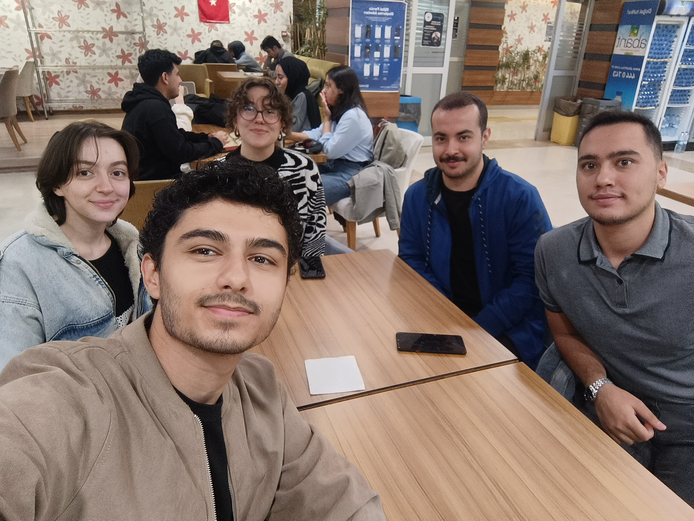

# GROUP14

## Group Members
- Bilgenur Erkan
- Buse Köroğlu
- Enes Eldeş
- Enes Mert Aydın
- İdris Aydın

  

## Repository Overview
This repository will be used to build a smart home automation application using object-oriented programming (OOP) principles. Detailed information about the project will be added in future commits.
